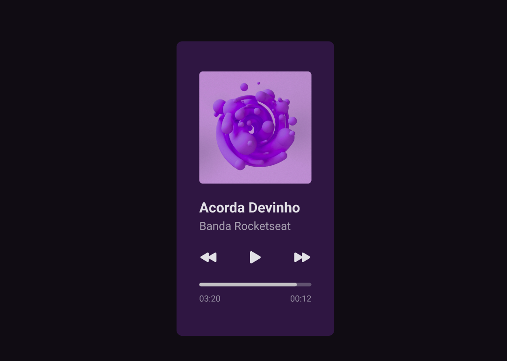

<h1 align="center"> Devinho Player </h1>

player de música 

<h3 align="center"><a href="https://jairo-sousa.github.io/devinho-player/" >Clique para visitar o projeto</a></h3>

## Projeto

Desafio semanal [#boracodar](https://boracodar.dev/) proposto pela [rocketseat](https://www.rocketseat.com.br/)

#01 - um player de música

## Layout

Você pode visualizar o layout do projeto através [DESSE LINK](https://www.figma.com/file/d57YVclHDiAMjmAKahRNVG/boraCodar-Desafio-1-Copy?fuid=988608188197102518). É necessário ter conta no [FIGMA](https://www.figma.com/) para editá-lo.

---

Feito por <a href="https://github.com/jairo-sousa/" >Jairo Sousa</a>
